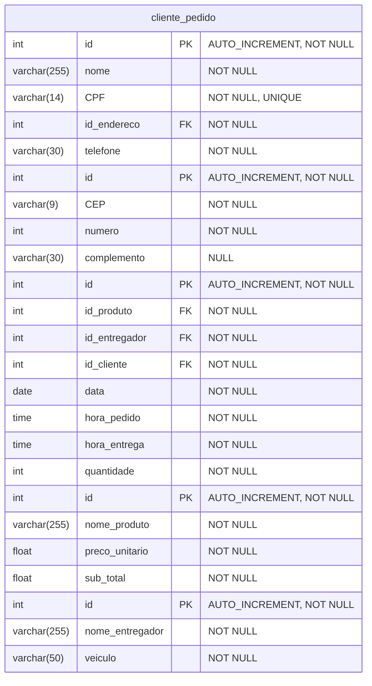

```mermaid
    erDiagram
        cliente_pedido{
            int id PK "AUTO_INCREMENT, NOT NULL"
            varchar(255) nome "NOT NULL"
            varchar(14) CPF "NOT NULL, UNIQUE"
            int id_endereco FK "NOT NULL"
            varchar(30) telefone "NOT NULL"
            int id PK "AUTO_INCREMENT, NOT NULL"
            varchar(9) CEP "NOT NULL"
            int numero "NOT NULL"
            varchar(30) complemento "NULL"
            int id PK "AUTO_INCREMENT, NOT NULL"
            int id_produto FK "NOT NULL"
            int id_entregador FK "NOT NULL"
            int id_cliente FK "NOT NULL"
            date data "NOT NULL"
            time hora_pedido "NOT NULL"
            time hora_entrega "NOT NULL"
            int quantidade "NOT NULL"
            int id PK "AUTO_INCREMENT, NOT NULL"
            varchar(255) nome_produto "NOT NULL"
            float preco_unitario "NOT NULL"
            float sub_total "NOT NULL"
            int id PK "AUTO_INCREMENT, NOT NULL"
            varchar(255) nome_entregador "NOT NULL"
            varchar(50) veiculo "NOT NULL"
        }
```