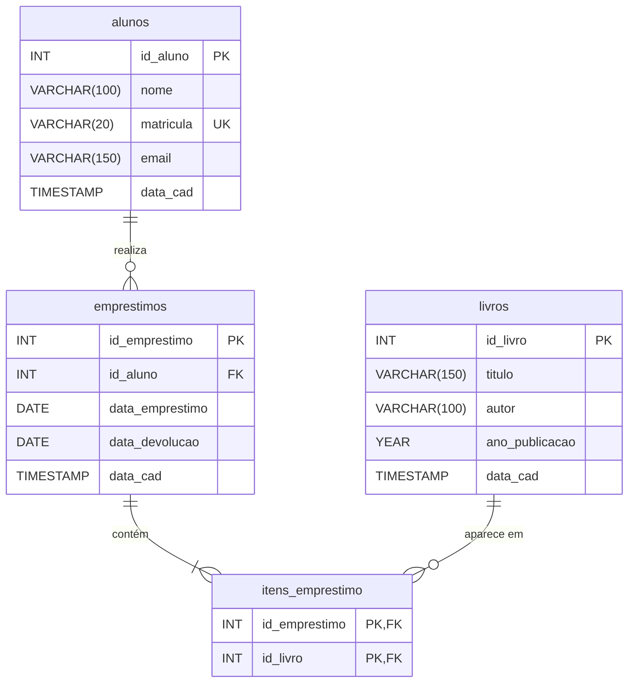

Diagrama entidade-relacionamento

```mermaid
erDiagram
    direction TB
    alunos {
        INT id_aluno PK
        VARCHAR(100) nome
        VARCHAR(20) matricula UK
        VARCHAR(150) email
        TIMESTAMP data_cad
    }
    livros {
        INT id_livro PK
        VARCHAR(150) titulo
        VARCHAR(100) autor
        YEAR ano_publicacao
        TIMESTAMP data_cad
    }
    emprestimos {
        INT id_emprestimo PK
        INT id_aluno FK
        DATE data_emprestimo
        DATE data_devolucao
        TIMESTAMP data_cad
    }
    itens_emprestimo {
        INT id_emprestimo PK, FK
        INT id_livro PK, FK
    }
    alunos ||--o{ emprestimos : "realiza"
    emprestimos ||--|{ itens_emprestimo : "contém"
    livros ||--o{ itens_emprestimo : "aparece em"
```
