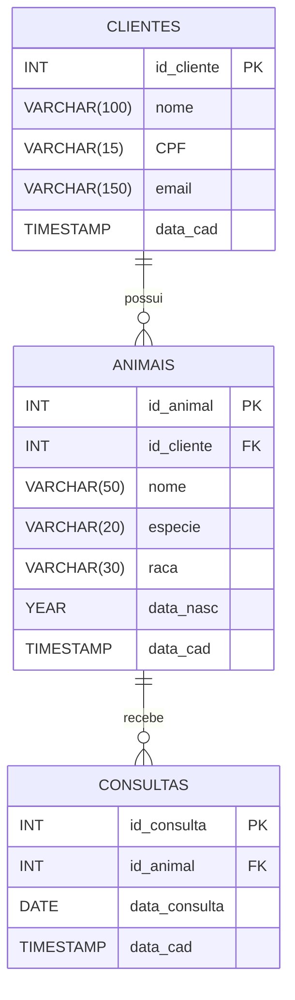

```mermaid
erDiagram
    CLIENTES ||--o{ ANIMAIS : possui
    ANIMAIS ||--o{ CONSULTAS : recebe

    CLIENTES {
        INT id_cliente PK
        VARCHAR(100) nome
        VARCHAR(15) CPF
        VARCHAR(150) email
        TIMESTAMP data_cad
    }

    ANIMAIS {
        INT id_animal PK
        INT id_cliente FK
        VARCHAR(50) nome
        VARCHAR(20) especie
        VARCHAR(30) raca
        YEAR data_nasc
        TIMESTAMP data_cad
    }

    CONSULTAS {
        INT id_consulta PK
        INT id_animal FK
        DATE data_consulta
        TIMESTAMP data_cad
    }
```
